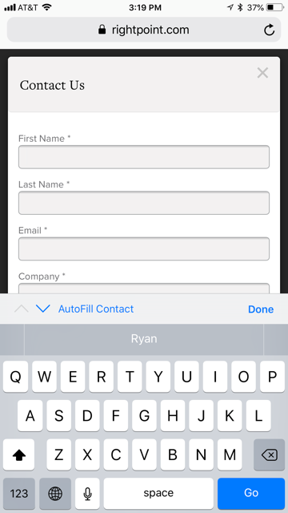

# Persisting Form Data

You can see [the form in action][sample].

## Autcomplete

Most modern browsers will [`autocomplete`][auto] certain information for form inputs. In order to make the `form-persister.js` work, you'll need add the `autocomplete` attribute to the `<form>` element:

```html
<form class="form" data-parsley-validate="" autocomplete="off">
```

> You can also disable `autocomplete` on the client using the `disableAutocomplete` [Configuration](#configuration) option below.

## UX Considerations for Requested Behavior

The script included in this repo leverages the HTML5 [`localStorage`][ls] API, which has the advantage of persisting key-value data across sessions (i.e. in contrast with `sessionStorage`).

There is a UX consideration before implementing this script. The input fields being used for the [contact form in the sample page][sample] are typical candidates for a browser's default `autocomplete` behavior or auto-completed fields based on user profiles (e.g. Keychain for OSX/iOS, Chrome's autocomplete, etc):

* First Name
* Last Name
* Email
* Phone Number

All of the above values map back to basic contact information stored in an end user's device. If you are an iPhone user, you can see this behavior in the wild by visiting <https://www.rightpoint.com/company/contact>, selecting the "Contact Us" button, and launching the modal form on the website:



By disabling `autocomplete`, you are running the risk of removing a convenient default behavior of the browser that may provide more convenience---and reliability---than something like the client-side solution provided with this script.

> **NOTE:** For reasons that should be *very* obvious, you would never want to write ***sensitive*** user input to `localStorage`.

## Configuration

You can call a new `FormPersister` with the following code:

```js
var contactForm = new FormPersister();
```

This will run the function with its default options. The full configuration options are as follows:

| Option | Default | Purpose |
| ------ | ------- | ------- |
| `inputSelector` | `"input, textarea"` | which elements to persist in localStorage | 
| `formSelector` | `"form"` | assigns single selector to form | 
| `assignInputIds` | `false` | adds unique IDs to each input; only a good idea if you are not able to assign IDs in `<form>` markup |
| `addDropdown` | `false` | specific code just for `dropp` inputs for RP contact form |
| `disableAutocomplete` | `false` | set to `true`, adds `autocomplete="off"` to `formSelector` | 

> Using `assignInputIds` may seem convenient but will lose all value if there is more than 1 form using the `form-persister.js` script on the website. Since "unique" IDs are added sequentially (e.g. `id=""`, `id="`)

The configuration run in the [sample page][sample] uses the following configuration:

```js
var contactForm = new FormPersister({
    inputSelector: ".form input, .form textarea",
    addDropdown: true,
    formSelector: ".form",
    disableAutocomplete: true
});
```

> **Note:** The markup for the form is different from that found on <http://anetakostic.com/RP-Site/Rightpoint.html> in that unique IDs have been added to each of the inputs being written to `localStorage` in the markup of the page itself.


## Dependencies

`form-persister.js` is written in `strict mode` in vanilla ES5 and does not require jQuery or transpilation tool to run. 


[auto]: https://developer.mozilla.org/en-US/docs/Web/Security/Securing_your_site/Turning_off_form_autocompletion
[ls]: https://developer.mozilla.org/en-US/docs/Web/API/Window/localStorage
[sample]: https://rdwatters.github.io/form-persister/
